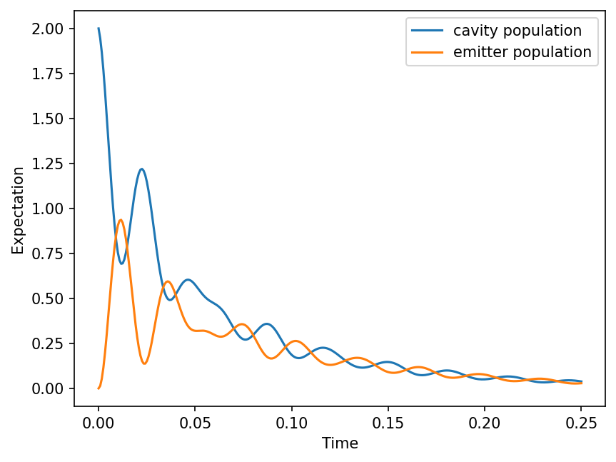
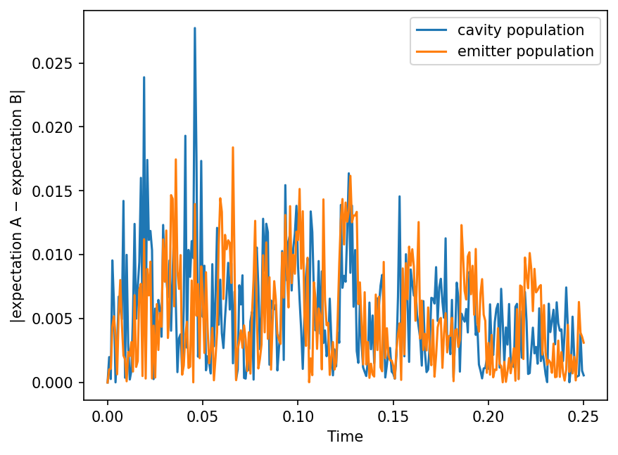

# ShadowSim.py

[](https://github.com/simsaidan/ShadowSim.py/actions/workflows/test-coverage.yml)
[](https://app.codecov.io/gh/simsaidan/ShadowSim.py)

## Overview

ShadowSim.py is an open-source Python library with two main purposes:

1. **Shadow Hamiltonian research**: support analysis and further research on shadow Hamiltonian simulation.
2. **Algorithm comparison**: make it easy to compare quantum simulation algorithms for **open** and **closed** systems.

**Note:** “Shadow” here means *shadow Hamiltonian simulation* ([Somma et al., arXiv:2407.21775](https://arxiv.org/abs/2407.21775)), **not** classical shadow tomography / randomized measurement protocols.

**When to use:** Use ShadowSim to build and inspect shadow Hamiltonians for small qubit systems, and to benchmark open- or closed-system simulation algorithms against a classical reference (e.g. QuTiP).

## Installation

### Development installation

Install [uv](https://docs.astral.sh/uv/), then fork and clone the repository:
```bash
git clone https://github.com/<your-github-username>/ShadowSim.py.git
cd ShadowSim.py
```

Sync the project (creates `.venv` and installs runtime plus test tools from `uv.lock`):
```bash
uv sync
```

### Install directly from GitHub

```bash
python -m pip install git+https://github.com/simsaidan/ShadowSim.py.git
```

The package can then be imported as `shadowsim`.

## Tests and coverage

```bash
uv sync
uv run pytest --cov=shadowsim --cov-config=.coveragerc --cov-report=term-missing
```

Pushes to `main` run the same in GitHub Actions and upload coverage to [Codecov](https://app.codecov.io/gh/simsaidan/ShadowSim.py) (enable the [Codecov GitHub app](https://github.com/apps/codecov) for this repo the first time so uploads succeed).

## Linting

Install the lint tools, then run [Ruff](https://docs.astral.sh/ruff/) check and format (CI runs the same checks):

```bash
uv sync --group lint
uv run --group lint ruff check .
uv run --group lint ruff format .
# CI equivalent of the format gate:
uv run --group lint ruff format --check .
```

## Usage

Public objects are imported from their domain subpackages:
```python
from shadowsim.core import Hamiltonian, Operator, State
from shadowsim.shadow import ShadowHamiltonian
from shadowsim.simulators import QutipSimulator
```

The following simulators are supported by the package:

| Name | Type | Can handle open systems |
| --- | --- | --- |
| Qutip simulator | classical | true |
| Split JMatrix | quantum-inspired | true |
| Trotterization (coming soon) | — | — |
| Wave matrix Lindbladization (coming soon) | — | — |
| Pauli propagation (coming soon) | — | — |

### Sparse / Pauli-label shadow construction

Pass Pauli labels (or `PauliSum`s) for both the Hamiltonian and the observables so
`ShadowHamiltonian` can build `H_S` in label space—no `4^n` tomography and no
full `2^n × 2^n` matrix multiplies during construction:

```python
from shadowsim.core import Hamiltonian, OperatorSet
from shadowsim.shadow import ShadowHamiltonian

shadow = ShadowHamiltonian(
    OperatorSet(["XII", "YII", "ZII", "IIX"]),
    [Hamiltonian("XII"), Hamiltonian("IIX")],
)
assert shadow.used_sparse_pauli_path
print(shadow.H_S.shape)  # (|closure|, |closure|)
```

Dense matrices and `LocalHamiltonian` terms still work; they take the densifying
fallback (`used_sparse_pauli_path` is `False`). See also
[`examples/simple_shadow.py`](examples/simple_shadow.py).

For practical scale limits (sparse vs dense, closure size, simulators), see
[Scalability / practical limits](#scalability--practical-limits).

## Scalability / practical limits

### Shadow construction

- Prefer Pauli labels / `PauliSum` so `ShadowHamiltonian` takes the sparse path
  (`used_sparse_pauli_path`). Cost then tracks Hamiltonian Pauli terms × closure
  size `m`, not `4^n`.
- Dense fallback (dense matrices / `LocalHamiltonian`): practical for small `n`
  (roughly ≤3–4 as historically exercised). Bottleneck is `4^n` Pauli tomography
  plus dense `2^n` linear algebra.
- Closure size `m` can grow independently of Hilbert-space dimension; `H_S` is
  always `m×m` (not `2^n×2^n`).
- Inspect cost before a long run: `ShadowHamiltonian(..., verbose=True)` prints
  Hamiltonian Pauli count, operator-set union size, and closure size.

### What works today

| Path | Practical scale today | Bottleneck |
| --- | --- | --- |
| `ShadowHamiltonian` (Pauli labels) | few-term models; `n` past ~3–4 when closure stays small | Pauli terms × closure size `m` |
| `ShadowHamiltonian` (dense / local) | small `n` (~≤3–4) | `4^n` tomography + dense mats |
| QuTiP simulator | small truncated models | stiff ODEs / Hilbert dim |
| Split JMatrix + Aer | tiny time grids / shot budgets for smoke; set `seed` for reproducible Aer shots | circuit per timestep × shots |

### Not yet / still heavy

GPU-backed shadows, open-system Lindblad shadow extensions, and a reduced smoke
grid for Example 2 are not provided yet. For shadow construction, use the
[sparse / Pauli-label path](#sparse--pauli-label-shadow-construction) whenever
you already have a Pauli decomposition.

## Examples

### Example 1: Exploring a simple shadow simulation example

The complete example is in [`examples/simple_shadow.py`](examples/simple_shadow.py)
and can be run after `uv sync`:
```bash
uv run python examples/simple_shadow.py
```
That example uses Pauli labels, so it takes the sparse construction path above.
Pass `verbose=True` to `ShadowHamiltonian` if you want Pauli-set and closure
sizes printed.

### Example 2: Comparing a quantum algorithm against a classical solver

This is a paper-scale QuTiP vs Split JMatrix + Aer comparison (`301` time points
and a non-trivial shot budget)—expect long wall time and nontrivial Aer cost; it
is not a CI smoke test. The runnable script
[`examples/simple_algo_benchmark.py`](examples/simple_algo_benchmark.py) uses the
same scale; there is no reduced smoke grid yet. See
[Scalability / practical limits](#scalability--practical-limits).

Imagine a scenario in which you want to compare the results of a new quantum
simulation algorithm against a source of truth like QuTiP. 

We first define some constants used in our system:
```python
import numpy as np

from shadowsim.benchmarking import Benchmark
from shadowsim.core import (
    Hamiltonian,
    LocalHamiltonian,
    LocalOperator,
    Operator,
    State,
)
from shadowsim.simulators import (
    QutipSimulator,
    SplitJMatrixSimulator,
    cavity_population,
    population_one,
)
from shadowsim.utils import (
    I,
    one_state_two_qubits,
    three_state_two_qubits,
    tensor,
    two_state_two_qubits,
    zero_state_two_qubits,
)

# Define system parameters
omega_c = 245000
omega_e = 245000
kappa = np.sqrt(24.5)
gamma = np.sqrt(0.4)
g = 100

a = (
    np.outer(zero_state_two_qubits, one_state_two_qubits)
    + np.sqrt(2) * np.outer(one_state_two_qubits, two_state_two_qubits)
    + np.sqrt(3) * np.outer(two_state_two_qubits, three_state_two_qubits)
)

zero = np.array([1, 0], dtype=np.complex128)
one = np.array([0, 1], dtype=np.complex128)
sigma = np.outer(zero, one)
```

Now that the system constants are built, let's define our operators. Since this
is an open-system simulation we have both Hamiltonians and Lindblad operators.

```python
H1 = omega_c * a.conjugate().T @ a
H2 = omega_e * np.outer(one, one)
H3 = g * (np.kron(a, sigma.conjugate().T) + np.kron(a.conjugate().T, sigma))

local_hamiltonians = [
    LocalHamiltonian(H1, [0, 1]),
    LocalHamiltonian(H2, [2]),
    LocalHamiltonian(H3, [0, 1, 2]),
]
full_hamiltonians = [
    Hamiltonian(tensor([H1, I])),
    Hamiltonian(tensor([I, I, H2])),
    Hamiltonian(H3),
]

# Define Lindblad operators
L1_full = Operator(kappa * np.kron(a, I))
L2_full = Operator(gamma * (tensor([I, I, sigma])))
L1_local = LocalOperator(kappa * a, [0, 1])
L2_local = LocalOperator(gamma * sigma, [2])

# Define initial state
psi_0 = State(tensor([two_state_two_qubits, zero]), 3)
```

Next, we create two simulators, one for the new algorithm and one for the 
source of truth. 

```python
# Qutip simulator
qutip_simulator = QutipSimulator(
    full_hamiltonians,
    [L1_full, L2_full],
    psi_0,
    [
        Operator(tensor([a.conjugate().T @ a, I])),
        Operator(tensor([I, I, sigma.conjugate().T @ sigma])),
    ],
    3,
    0.25,
    301,
)
# Split JMatrix simulator
splitjmatrix_simulator = SplitJMatrixSimulator(
    local_hamiltonians,
    [L1_local, L2_local],
    psi_0,
    3,
    0.25,
    301,
    40,
    measurement_groups=[[1, 2], 3],
    reducers=[cavity_population, population_one],
    shots=10000,
)
```

To easily compare results, we initialize a benchmark with a reference simulator
and one or more challengers. All simulators must share the same time grid.
We run the benchmark, which runs the underlying simulations. Numeric L∞ / L2 /
MAE / RMSE error metrics vs the reference are available via `error_metrics`.
Wall-clock time and shot budget (when a simulator exposes `shots`) are available
via `resource_metrics`. Both are exported together by `save_error_metrics` as
`{"errors": ..., "resources": ...}`. We can also visualize the result by calling
`save_result_plot`, which saves a plot per simulator and an absolute-difference
plot vs the reference for each challenger.

QuTiP is deterministic. Split JMatrix estimates populations from a finite
`shots` budget, so absolute-difference plots move run to run unless you set
`seed` (wired into Aer’s `seed_simulator`). Residual disagreement also includes
systematic split-J / Trotter bias that does not vanish with more shots. Use a
lower `shots` for smoke checks and a higher budget for publication figures; pass
`verbose=True` or a `progress(step, total)` callback for long-run feedback.

```python
benchmark = Benchmark(qutip_simulator, splitjmatrix_simulator)
benchmark.run()
print(benchmark.error_metrics())
print(benchmark.resource_metrics())
metrics_path = benchmark.save_error_metrics()
paths = benchmark.save_result_plot(labels=["cavity population", "emitter population"])
for path in [metrics_path, *paths]:
    print(f"Saved: {path}")
```

**Output**

*QuTiP (reference):*



*Split JMatrix:*


*Absolute difference between the two:*



## Documentation

## Contributing

Contributions are welcome and appreciated.

1. Fork the repository and clone your fork (see the Installation section).
2. Create a feature branch:
```bash
git checkout -b feature/your-change
```
3. Make your changes and keep commits focused.
4. Run tests and Ruff locally (`uv run pytest` and the linting commands above).
5. Open a pull request with a clear description of what changed and why.

For larger changes, please open an issue first to discuss scope and design.

## License

This project is licensed under the MIT License. See `LICENSE` for details.

## Citing

DOI coming soon.

## References

- [](https://arxiv.org/abs/2407.21775) Somma, R. D., King, R., Kothari, R., O'Brien, T., and Babbush, R. *Shadow Hamiltonian Simulation*. [PDF](https://arxiv.org/pdf/2407.21775)
- [](https://arxiv.org/abs/2501.18522v2) Sims, A. N., Patel, D., Philip, A., Rubin, A. H., Bandyopadhyay, R., Radulaski, M., and Wilde, M. M. *Digital Quantum Simulations of the Non-Resonant Open Tavis-Cummings Model*. [PDF](https://arxiv.org/pdf/2501.18522v2)

