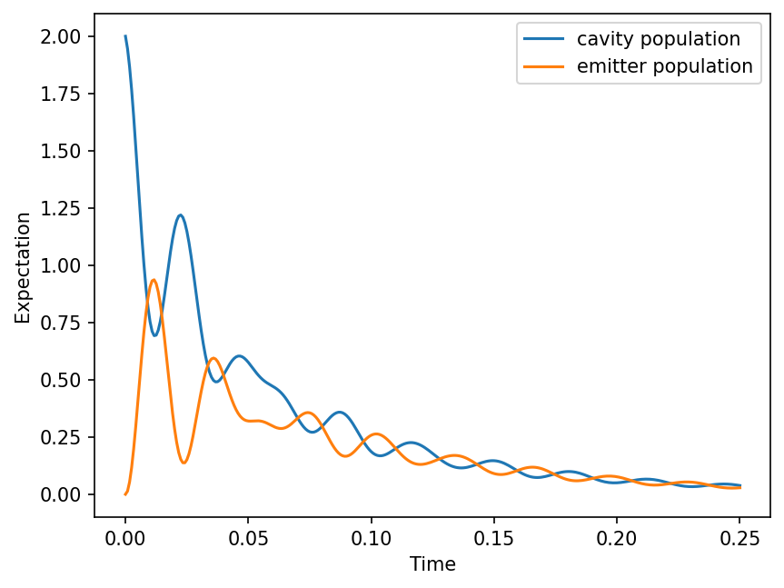
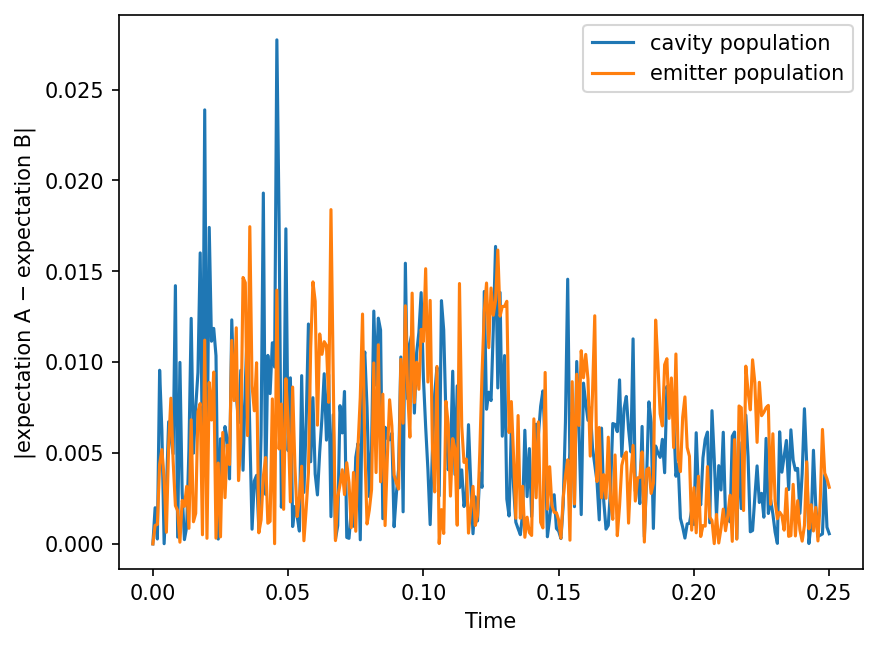

# ShadowSim.py

[](https://github.com/simsaidan/ShadowSim.py/actions/workflows/test-coverage.yml)
[](https://app.codecov.io/gh/simsaidan/ShadowSim.py)

## Overview

ShadowSim.py is an open-source Python library with two main purposes:

1. **Shadow Hamiltonian research**: support analysis and further research on shadow Hamiltonian simulation.
2. **Algorithm comparison**: make it easy to compare quantum simulation algorithms for **open** and **closed** systems.

**Note:** “Shadow” here means *shadow Hamiltonian simulation* ([Somma et al., arXiv:2407.21775](https://arxiv.org/abs/2407.21775)), **not** classical shadow tomography / randomized measurement protocols.

**When to use:** Use ShadowSim to build and inspect shadow Hamiltonians for small qubit systems, and to benchmark open- or closed-system simulation algorithms against a classical reference (e.g. QuTiP).

## Installation

The core package depends only on NumPy. QuTiP, Qiskit, and Matplotlib are optional extras:

```bash
python -m pip install git+https://github.com/simsaidan/ShadowSim.py.git
python -m pip install "shadowsim[qutip] @ git+https://github.com/simsaidan/ShadowSim.py.git"
python -m pip install "shadowsim[qiskit] @ git+https://github.com/simsaidan/ShadowSim.py.git"
python -m pip install "shadowsim[viz] @ git+https://github.com/simsaidan/ShadowSim.py.git"
python -m pip install "shadowsim[all] @ git+https://github.com/simsaidan/ShadowSim.py.git"
```

| Extra | Provides |
| --- | --- |
| `qutip` | `QutipSimulator`, `run_shadow_simulation`, and QuTiP interop (`from_qutip` / `to_qutip`) |
| `qiskit` | Split JMatrix and Trotterization (`qiskit`, `qiskit-aer`, and `scipy`) |
| `viz` | Matplotlib plots (`plot_results` and benchmark figures) |
| `all` | `qutip`, `qiskit`, and `viz` |

The package can then be imported as `shadowsim`. Importing a backend or plot helper without its extra raises an `ImportError` that names the extra to install.

For a local development install (`uv sync --all-extras`, tests, lint, scaffolding a simulator),
see [CONTRIBUTING.md](CONTRIBUTING.md).

## Usage

Public objects are imported from their domain subpackages:
```python
from shadowsim.core import DensityOperator, Hamiltonian, Operator, State
from shadowsim.shadow import ShadowHamiltonian, check_invariance
from shadowsim.simulators import QutipSimulator, SimulationResult
```

### QuTiP interop

With the `qutip` extra, convert between QuTiP `Qobj` values and ShadowSim core types:

```python
from shadowsim.interop.qutip import from_qutip, to_qutip

H = from_qutip(qutip_H)  # → Hamiltonian
ops = [from_qutip(c) for c in c_ops]  # → Operator
psi = from_qutip(psi0)  # → State (ket)
rho = from_qutip(qutip_rho)  # → DensityOperator (Hermitian, PSD, tr≈1)
qobj = to_qutip(H)
```

Override with `kind=` when needed (e.g. `kind="hamiltonian"` for a unit-trace projector).

### Simulation results

Each backend’s `simulate()` / `run()` returns a `SimulationResult` with:

- `times`, `observables` (expectation traces), optional `states` (usually `None`)
- `seed`, `algorithm`, `runtime`, and `metadata` (software version, grid params, backend params)

Serialize and reload with `result.save(path)` / `SimulationResult.load(path)` (directory of
`.npy` arrays plus `meta.json`). Low-level expectation curves remain on `simulator.results`
for plotting and benchmarking.

The following simulators are supported by the package:

| Name | Type | Can handle open systems |
| --- | --- | --- |
| Qutip simulator | classical | true |
| Split JMatrix | quantum-inspired | true |
| Trotterization | quantum-inspired | false |
| Wave matrix Lindbladization (coming soon) | — | — |
| Pauli propagation (coming soon) | — | — |

### Sparse / Pauli-label shadow construction

Pass Pauli labels (or `PauliSum`s) for both the Hamiltonian and the observables so
`ShadowHamiltonian` can build `H_S` in label space—no `4^n` tomography and no
full `2^n × 2^n` matrix multiplies during construction:

```python
from shadowsim.core import Hamiltonian, OperatorSet
from shadowsim.shadow import ShadowHamiltonian

shadow = ShadowHamiltonian(
    OperatorSet(["XII", "YII", "ZII", "IIX"]),
    [Hamiltonian("XII"), Hamiltonian("IIX")],
)
assert shadow.used_sparse_pauli_path
print(shadow.H_S.shape)  # (|closure|, |closure|)
```

Dense matrices and `LocalHamiltonian` terms still work; they take the densifying
fallback (`used_sparse_pauli_path` is `False`). See also
[`examples/simple_shadow.py`](examples/simple_shadow.py).

To check whether a given operator set already satisfies the invariance property
(closed under `[H, ·]`) without building a full shadow simulation, use
`check_invariance`. It reports whether the set is closed, how many Pauli labels
must be added to close it, and whether the closed-basis `H_S` is Hermitian:

```python
from shadowsim.core import Hamiltonian, OperatorSet
from shadowsim.shadow import check_invariance

report = check_invariance(
    OperatorSet(["Z"]),
    Hamiltonian("X"),
)
assert not report.is_closed
assert report.growth == 1
assert report.added_paulis == frozenset({"Y"})
```

For practical scale limits (sparse vs dense, closure size, simulators), see
[Scalability / practical limits](#scalability--practical-limits).

## Scalability / practical limits

### Shadow construction

- Prefer Pauli labels / `PauliSum` so `ShadowHamiltonian` takes the sparse path
  (`used_sparse_pauli_path`). Cost then tracks Hamiltonian Pauli terms × closure
  size `m`, not `4^n`.
- Dense fallback (dense matrices / `LocalHamiltonian`): practical for small `n`
  (roughly ≤3–4 as historically exercised). Bottleneck is `4^n` Pauli tomography
  plus dense `2^n` linear algebra.
- Closure size `m` can grow independently of Hilbert-space dimension; `H_S` is
  always `m×m` (not `2^n×2^n`).
- Inspect cost before a long run: `ShadowHamiltonian(..., verbose=True)` prints
  Hamiltonian Pauli count, operator-set union size, and closure size.

### What works today

| Path | Practical scale today | Bottleneck |
| --- | --- | --- |
| `ShadowHamiltonian` (Pauli labels) | few-term models; `n` past ~3–4 when closure stays small | Pauli terms × closure size `m` |
| `ShadowHamiltonian` (dense / local) | small `n` (~≤3–4) | `4^n` tomography + dense mats |
| QuTiP simulator | small truncated models | stiff ODEs / Hilbert dim |
| Split JMatrix + Aer | tiny time grids / shot budgets for smoke; set `seed` for reproducible Aer shots | circuit per timestep × shots |
| Trotterization + Aer | closed systems only; tiny time grids / shot budgets; set `seed` for reproducible Aer shots | circuit per timestep × shots |

### Not yet / still heavy

GPU-backed shadows, open-system Lindblad shadow extensions, and a reduced smoke
grid for Example 2 are not provided yet. For shadow construction, use the
[sparse / Pauli-label path](#sparse--pauli-label-shadow-construction) whenever
you already have a Pauli decomposition.

## Examples

### Example 1: Exploring a simple shadow simulation

The complete example is in [`examples/simple_shadow.py`](examples/simple_shadow.py)
and can be run after `uv sync --all-extras`:
```bash
uv run python examples/simple_shadow.py
```
That example uses Pauli labels (sparse construction path) and
`run_shadow_simulation` for the reduced shadow dynamics.
Pass `verbose=True` to `run_shadow_simulation` if you want Pauli-set and
closure sizes printed.

### Example 2: Comparing a quantum algorithm against a classical solver

This is a paper-scale QuTiP vs Split JMatrix + Aer comparison (`301` time points
and a non-trivial shot budget)—expect long wall time and nontrivial Aer cost; it
is not a CI smoke test. The runnable script
[`examples/simple_algo_benchmark.py`](examples/simple_algo_benchmark.py) uses the
same scale; there is no reduced smoke grid yet. See
[Scalability / practical limits](#scalability--practical-limits).

Imagine a scenario in which you want to compare the results of a new quantum
simulation algorithm against a source of truth like QuTiP.

We build the open cavity–emitter (Tavis–Cummings–like) model with the shared
factory. Defaults match the historical Example 2 parameters; pass
`n_emitters`, `g`, `kappa`, and friends to change the physics without rewriting
operator embeddings.

```python
from shadowsim.benchmarking import Benchmark
from shadowsim.models import tavis_cummings
from shadowsim.simulators import QutipSimulator, SplitJMatrixSimulator

model = tavis_cummings()
```

Next, we create two simulators, one for the new algorithm and one for the
source of truth.

```python
# Qutip simulator
qutip_simulator = QutipSimulator(
    model.full_hamiltonians,
    model.c_ops_full,
    model.psi0,
    model.e_ops,
    model.num_qubits,
    0.25,
    301,
)
# Split JMatrix simulator
splitjmatrix_simulator = SplitJMatrixSimulator(
    model.local_hamiltonians,
    model.c_ops_local,
    model.psi0,
    model.num_qubits,
    0.25,
    301,
    40,
    measurement_groups=model.measurement_groups,
    reducers=list(model.reducers),
    shots=10000,
)
```

To easily compare results, we initialize a benchmark with a reference simulator
and one or more challengers. All simulators must share the same time grid.
We run the benchmark, which runs the underlying simulations. Numeric L∞ / L2 /
MAE / RMSE error metrics vs the reference are available via `error_metrics`.
Wall-clock time and shot budget (when a simulator exposes `shots`) are available
via `resource_metrics`. Both are exported together by `save_error_metrics` as
`{"errors": ..., "resources": ...}`. We can also visualize the result by calling
`save_result_plot`, which saves a plot per simulator and an absolute-difference
plot vs the reference for each challenger.

QuTiP is deterministic. Split JMatrix estimates populations from a finite
`shots` budget, so absolute-difference plots move run to run unless you set
`seed` (wired into Aer’s `seed_simulator`). Residual disagreement also includes
systematic split-J / Trotter bias that does not vanish with more shots. Use a
lower `shots` for smoke checks and a higher budget for publication figures; pass
`verbose=True` or a `progress(step, total)` callback for long-run feedback.

```python
benchmark = Benchmark(qutip_simulator, splitjmatrix_simulator)
benchmark.run()
print(benchmark.error_metrics())
print(benchmark.resource_metrics())
metrics_path = benchmark.save_error_metrics()
paths = benchmark.save_result_plot(labels=["cavity population", "emitter population"])
for path in [metrics_path, *paths]:
    print(f"Saved: {path}")
```

**Output**

*QuTiP (reference):*



*Split JMatrix:*


*Absolute difference between the two:*



### Example 3: Classical and transverse-field Ising models

[`examples/ising_chain.py`](examples/ising_chain.py) builds Ising Hamiltonians with
the shared factory and evolves a small open transverse-field chain in QuTiP.

```bash
uv run python examples/ising_chain.py
```

```python
from shadowsim.models import ising
from shadowsim.simulators import QutipSimulator

# Transverse-field Ising: H = J Σ Z_i Z_j + h Σ X_i
model = ising(
    n_qubits=4,
    J=1.0,
    h=0.5,
    field="transverse",  # or "classical" for a Z field
    topology="chain",
    boundary="open",  # or "periodic"
)

# Custom connectivity (overrides chain presets)
custom = ising(
    n_qubits=4,
    J=1.0,
    h=0.5,
    field="classical",
    edges=[(0, 1), (1, 2), (2, 3), (0, 2)],
)

simulator = QutipSimulator(
    model.full_hamiltonians,
    model.c_ops_full,  # empty; closed system
    model.psi0,
    model.e_ops,
    model.num_qubits,
    2.0,
    101,
)
result = simulator.simulate()
```

Use `model.hamiltonian` or `model.pauli_sum` when you only need the combined
Hamiltonian (for example with `run_shadow_simulation`). Contiguous
nearest-neighbor ZZ terms are also available as `model.local_hamiltonians` for
Split-J / Trotter; non-contiguous edges (periodic wrap or custom long-range
couplings) appear only in the full-space operators.

## Documentation

- [API / site docs](https://simsaidan.github.io/ShadowSim.py/) (`docs/`; preview with `uv sync --group docs && uv run mkdocs serve`)
- [Contributing](CONTRIBUTING.md)

## Contributing

See [CONTRIBUTING.md](CONTRIBUTING.md) for development setup, tests, linting,
simulator scaffolding, and pull-request guidelines.

## License

This project is licensed under the MIT License. See `LICENSE` for details.

## Citing

DOI coming soon.

## References

- [](https://arxiv.org/abs/2407.21775) Somma, R. D., King, R., Kothari, R., O'Brien, T., and Babbush, R. *Shadow Hamiltonian Simulation*. [PDF](https://arxiv.org/pdf/2407.21775)
- [](https://arxiv.org/abs/2501.18522v2) Sims, A. N., Patel, D., Philip, A., Rubin, A. H., Bandyopadhyay, R., Radulaski, M., and Wilde, M. M. *Digital Quantum Simulations of the Non-Resonant Open Tavis-Cummings Model*. [PDF](https://arxiv.org/pdf/2501.18522v2)
